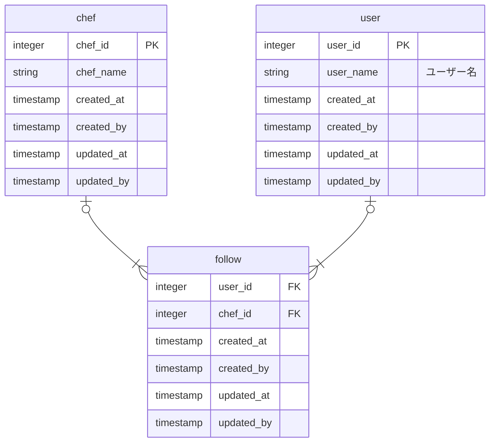

```mermaid
erDiagram
  chef {
      integer chef_id PK
      string chef_name
      timestamp created_at
      timestamp created_by
      timestamp updated_at
      timestamp updated_by
    }

  follow {
    integer user_id FK
    integer chef_id FK
    timestamp created_at
    timestamp created_by
    timestamp updated_at
    timestamp updated_by
  }

  user {
      integer user_id PK
      string user_name "ユーザー名"
      timestamp created_at
      timestamp created_by
      timestamp updated_at
      timestamp updated_by
    }

  chef |o--|{ follow : ""
  user |o--|{ follow : ""

```
